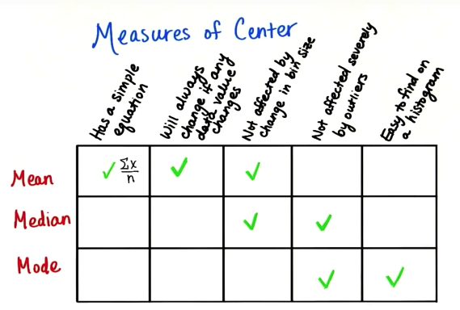
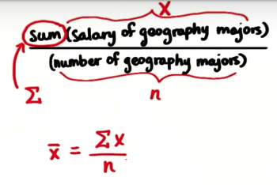
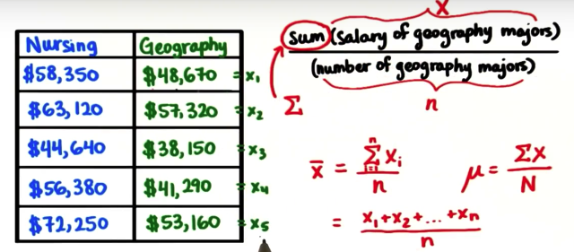
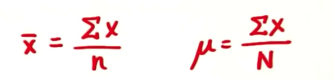

# 描述统计学

> 这里只针对一些知识做简要的记录

## 研究方法

<b>一句话概括统计学研究方法：学习构建、总体与样本、相关与因果、假设与试验</b>

- 构建：抽象的概念如何描述，即如何根据参数来描述问题

- 可以度量构建（抽象）的可操作定义（参数），构建被测量后，我们便可以分析它们了

- 当更多的因素为常量时，测试结果就更可信

- 统计量：描述样本的数字
- 变量：描述各个数据点的特征，例如性别等
- 常量：不会改变的数

## 调查方法

安慰剂方法：为了让调查有对比，需要让正常的人也参与进来，比如服药，不能给真实的药，只能用安慰剂，但也不能让他们知道是安慰剂

在这样的基础上我们又可以划分为单盲和双盲：

- 单盲：只让被调查方不知道自己服用的是否有效的药

- 双盲：被调查者和统计者都不让知道，一面影响统计者判断

## 数据可视化

- 频次：出现的次数

- 相对频率：每一种类与总体的比

- 组距：指每组的最高数值与最低数值之间的距离

- 直方图软件：Interactivate

- 正态分布：会有峰值叫做众数，图对称，众数=中位数=平均值

- 偏斜分布：当多数数据集中在曲线的一端，而少数数据在曲线的另一端，数据分布的形态就产生了偏斜。当偏斜的一边的趋向正数的方向，叫正偏态。当偏斜的一边的趋向负数的方向叫负偏态。

## 集中趋势

> 集中趋势，我们要学会用一个数字描述的三种量度，即均值、中位数和众数

- 中位数：分布在中间的值,中位数是位于“中间”的数据，意味着有一半数据值小于它，而另一半大于它。由于存在偏斜分布，所以用中位数来代表平均水平（为了避免有异常值影响平均值）。中位数如果不是正好有一个值在中间，则取中间两个值的平均值。比如1，3，5，7，8，10队列的中位数是（5+7）/2

- 众数：出现次数最多的众数，众数分类可能有多个众数会有多个众数，比如鞋，男鞋中有一个众数，女鞋中有一个众数。所以众数可用于描述任何数据类型，数值型和类别型都可以

- 均值：平均数

- 均值、中位数和众数特性

  -   有一个简单的公式
  -   如果数据集中有数据的值变化，它也一定会变化
  -   不受组距变化的影响
  -   不易受到异常值的影响
  -   容易在直方图上找到

## 数学符号

> 用符号讲故事，语言如此，数学也如此

- μ（总体参数）：用来描述整个总体的值,即抽样总体的数

- $\overline{x}$(样本参数)：用来描述样本（总体中的某一部分）的值；我们使用统计量来估计总体参数。估计值是我们对总体参数的最佳猜测。所以，我们可以使用 X-bar 来估计μ。参数（μ）是用来描述整个总体的值。

> μ和x-bar的两者之间的差别叫做抽样误差

- 均值数字表达如下图

- 均值数字符号进一步描述

- 我们用上面的样本参数和总体参数针对均值来说明，左边的是样本的平均值，右边的是总体的平均值的符号写法

- 中位数公式，数据集个数为偶数 \frac{X\frac{n}{2}+X\frac{n}{2}+1}{2} 数据为偶数X\frac{n+1}{2}

